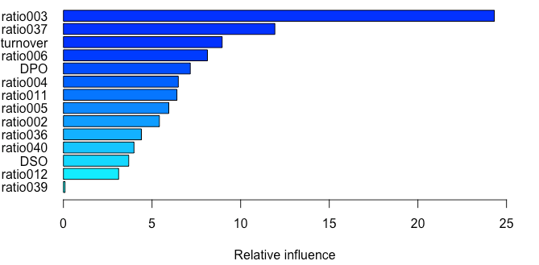

[](http://quantlet.de/)

## [](http://quantlet.de/) **AdaBoost_P2PL** [](http://quantlet.de/)

```yaml

Name of QuantLet : 'AdaBoost_P2PL'


Published in : 'Metis' 


Description : 'AdaBoost classification model for defaults of P2P loans. Compares the out-of-sample predictive performance to a baseline logistic regression model.'


Keywords : 'Boosting, AdaBoost, classification, logistic regression'


Author : 'Konstantin Häusler'

```




### R Code
```r

#clear work space
rm(list = ls(all = TRUE))
graphics.off()

# install and load packages
libraries = c("caret","LogicReg","e1071","pROC", "gbm")
lapply(libraries, function(x) if (!(x %in% installed.packages())) {
  install.packages(x)
})
lapply(libraries, library, quietly = TRUE, character.only = TRUE)


# set the working directory
setwd("~/Desktop/dateien/IRTG 1792/METIS/metis_presi/Rcode/")

# Read in data
data = read.csv("~/Desktop/dateien/IRTG 1792/METIS/metis_presi/Rcode/p2p.csv")

data$status.bin <- data$status
data$status.bin <- factor(data$status.bin)

data$status = as.character(factor(data$status))
data$status = as.numeric(data$status)


# Split into training and test data
set.seed(1234)
ind = createDataPartition(y=data$status, p=0.8, list=F)
train = data[ind,]
test = data[-ind,]

#AdaBoost
fit_ada = gbm(status ~ ratio002 + ratio003 + ratio004 + ratio005 + ratio006 + 
                ratio011 + ratio012 + DPO + DSO + turnover + ratio036 + ratio037 + 
                ratio039 + ratio040, distribution = "adaboost", data = train,
                n.trees = 1000,interaction.depth = 1, n.minobsinnode = 10, shrinkage = 0.1,
                bag.fraction = 0.5, train.fraction = 1, cv.folds = 0,
                keep.data = TRUE, verbose = FALSE, class.stratify.cv = NULL)

#variable importance
summary.gbm(fit_ada, las=1, xlim=c(0,25))

#insights
print(fit_ada)

#predictions on test set
pred_ada = predict(fit_ada, n.trees = 1000, newdata= test, type = "response")

#treshold
label <- function(data) {
  data[data>=0.5] = 1
  data[data<0.5] = 0
  return(data)
}

confusion_inputs <- function(predictions, target){
  u = union(predictions, target)
  t = table(factor(predictions, u), factor(target, u))
  return(t)
}

pred_ada_conf = label(pred_ada)
status_conf = label(test$status)

#confusion matrix 
confusionMatrix(confusion_inputs(pred_ada_conf, status_conf))
#confusionMatrix(pred_ada, test$status)

#ROC curve
plot(roc(test$status, pred_ada, 
         levels=c(0, 1), 
         direction = "<"),
         identity.lty = 2,
         identity.lwd = 2,
         print.auc=TRUE,
         #auc.polygon=TRUE,
         lty = 1,
         lwd = 3,
         col = c("darkred"),
         asp = NA)

#stargazer(data, digits = 2, align = T)

#logistic regression
fit_log = glm(status.bin~ratio002 + ratio003 + ratio004 + ratio005 + ratio006 + 
                ratio011 + ratio012 + DPO + DSO + turnover + ratio036 + ratio037 + 
                ratio039 + ratio040,family="binomial",data=train)
#prediction
pre_log = as.numeric(predict(fit_log,newdata=test,type="response"))
class_log = factor(ifelse(pre_log>0.5,1,0))

#roc curve
plot(roc(test$status,pre_log),
        levels=c(0, 1), 
        direction = "<",
        identity.lty = 2,
        identity.lwd = 2,
        print.auc=TRUE,
        #auc.polygon=TRUE,
        lty = 1,
        lwd = 3,
        col = c("darkred"),
        asp = NA)

```

automatically created on 2020-07-08